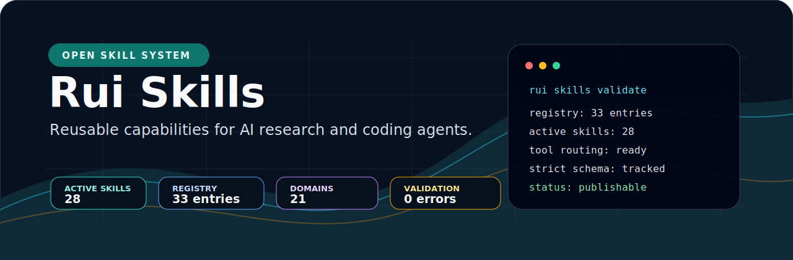
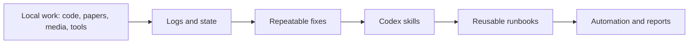

# Rui Workbench

**Local-first agent systems, Codex skills, recovery runbooks, and automation workflows.**

---

## Overview

Rui Workbench is a public index for the local agent systems I build and maintain: Codex skills, Windows/WSL repair workflows, media delivery runbooks, reproducible Python environments, and research tooling.

The goal is to turn hard-won local engineering experience into reusable, inspectable workflows. The emphasis is not on generic API wrappers, but on the operational details that make AI-assisted work reliable on a real machine: logs, state files, recovery paths, portability, and verification.

## Highlights

| Layer | What it does | Current direction |
| --- | --- | --- |
| ResearchFlow | Collects, indexes, audits, and queries research papers | Local knowledge base for papers and notes |
| Codex skills | Turns repeated agent work into reusable procedures | Public skill drafts and private local automation |
| Recovery runbooks | Captures Windows, WSL, media, and tooling failure modes | Practical repair paths backed by logs and checks |
| Anaconda runtime | Keeps Python tools isolated and recoverable | Clean envs for research, yt-dlp, and data tools |
| Media pipeline | Extracts and organizes web/media metadata | yt-dlp source workspace and structured downloads |

## Featured Work

| Project | Why it matters |
| --- | --- |
| [Codex skill drafts](./skills) | Public agent skills for local reliability, plugin recovery, media delivery, memory, portability, and Windows repair |
| [ResearchFlow](https://github.com/RipeMangoBox/ResearchFlow) | A local research assistant for paper retrieval, notes, indexes, and knowledge queries |
| `yt-dlp` local workspace | Editable source-linked media tooling in an isolated Anaconda environment |
| Codex skill library | A growing set of local skills for documents, Zotero, GitHub, life-science research, and automation |

## System Map

## Stack

  
  
  
  
  
  
  

## Principles

- Local-first by default.
- Clear files, logs, checkpoints, and recovery paths.
- Automation that helps before it tries to impress.
- Research notes and code treated as one thinking system.
- Environments kept boring, explicit, and portable.

## Roadmap

- [ ] Turn ResearchFlow outputs into cleaner shareable reports.
- [ ] Add repeatable paper collection and metadata QA recipes.
- [ ] Build a small media metadata workflow around yt-dlp.
- [ ] Expand the public skills into tested templates with small helper scripts.

## GitHub Snapshot

---

**Building local agent workflows that survive real machines, real logs, and real failure modes.**

